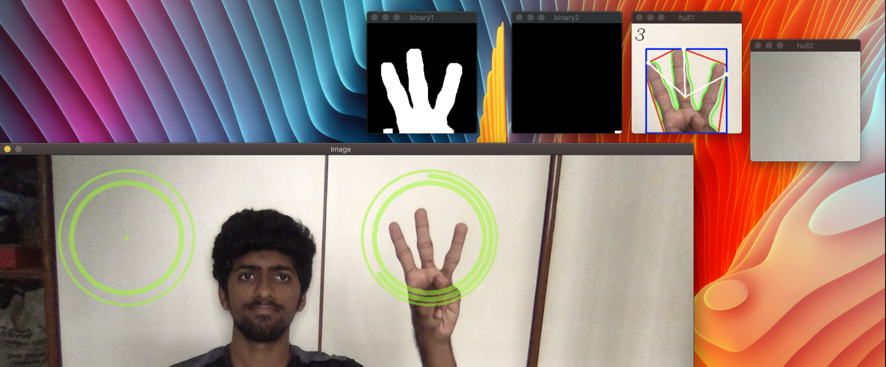
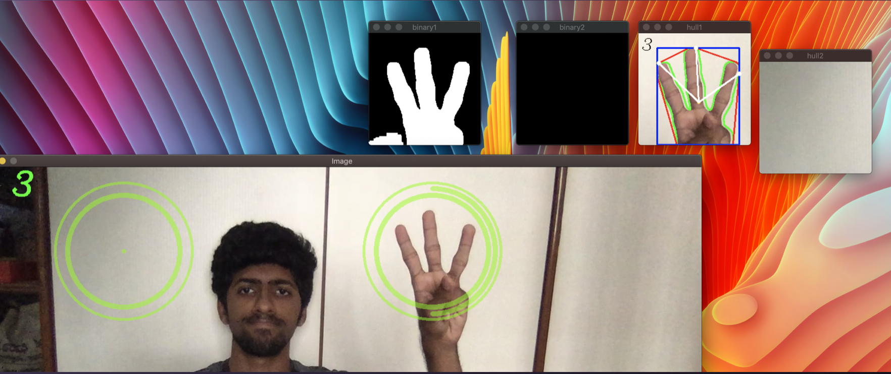
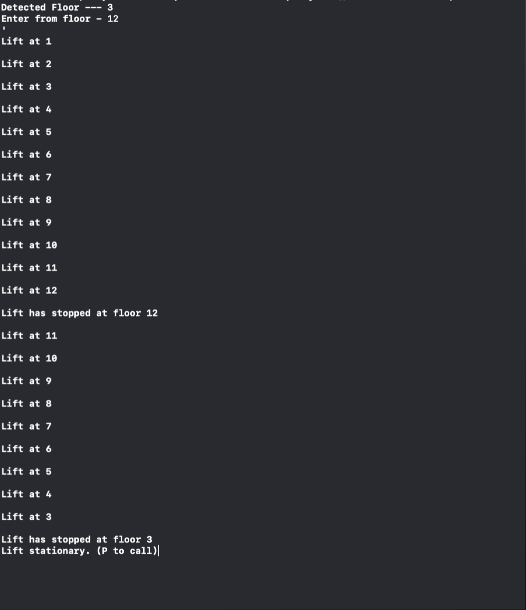

# Elevator with hand recognition

A C++ implementation of elevator movement with hand recognition using OpenCV

This code uses hand recognition to detect which floor a person would like to reach before entering the lift itself.

OpenCV is used to detect the number of fingers on a user's hand.

### Screenshots

**Detecting**

**Detected**

**Lift movement**

For more information on code, check my website [here](https://suryadheeshjith.github.io/projects/elevator_with_hand_recog/)

### Authors

1. Surya Dheeshjith
2. Varun Komperla
